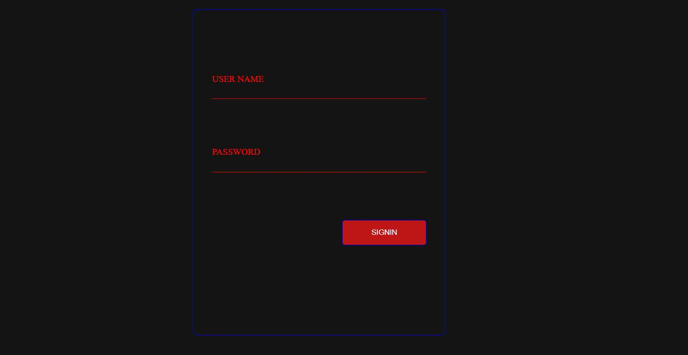
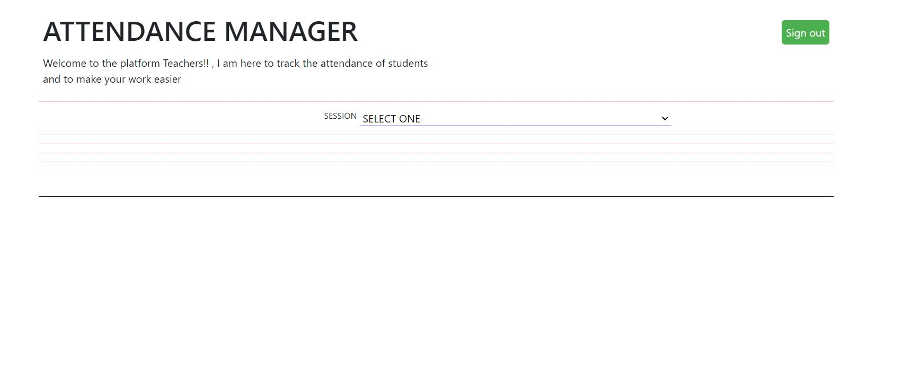
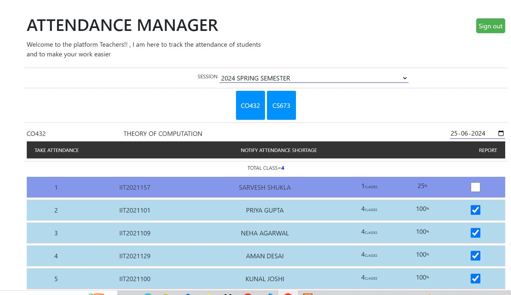
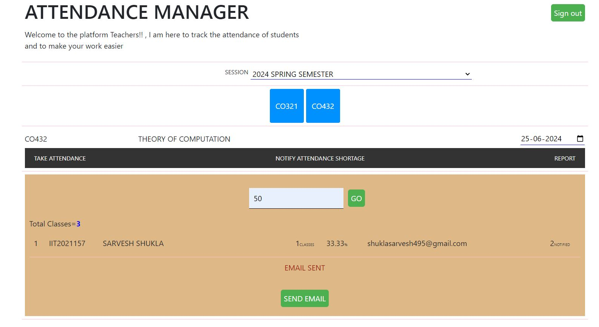

# Attendance Manager
Attendance Manager is a web-based application designed to help teachers and professors track student attendance records efficiently. It provides tools for attendance management, reporting, and communication with students via email notifications regarding attendance.

## Features

- **Attendance Tracking**: Record student attendance using a user-friendly interface.
- **Attendance Percentage**: Automatically calculate and display the attendance percentage for each student.
- **Reporting**: Generate attendance reports for the entire class.
- **Email Notifications**: Notify students via email when their attendance falls below a specified criteria.
- **Database**: Utilizes SQL database (via XAMPP and PHPMyAdmin) for storing attendance records securely.
- **Technologies Used**: HTML, CSS, JavaScript (JS), SQL, XAMPP, PHP.

## Screenshots

*Login Page: Professors or teachers can sign in to access attendance management, reports, and email notifications.*

*Dashboard: Page displayed after successful login.*

*Attendance Sheet: Allows teachers to track attendance by selecting dates from a calendar.*

*Email Notification Setup: Uses SMTP in XAMPP Apache configuration to notify students via email.*

*Email Example: Sample email received by a student for low attendance notification.*

## Demo Video

[Watch the demo video]([link-to-video](https://youtu.be/5g8xqb06zU4?si=d-HilNUrKiBT4saR)) <!-- Here is the short video link of working project -

## Getting Started

### Setup Database

1. **Install XAMPP**:
   - Download and install [XAMPP](https://www.apachefriends.org/index.html).
   - Start Apache and MySQL services.

2. **Import Database**:
   - Launch PHPMyAdmin from XAMPP control panel (usually at `http://localhost/phpmyadmin`).
   - Create a new database named `attendance_manager`.
   - Import the SQL file (`database.sql`) provided in the repository into the `attendance_manager` database.

### Configure SMTP for Email Notifications

1. **Enable SMTP in XAMPP Apache Configuration**:
   - Open XAMPP control panel.
   - Click on "Config" next to Apache and select "PHP.ini".
   - Search for `[mail function]` and configure SMTP settings.
   - Save changes and restart Apache.

2. **Configure SMTP Settings in `config.php`**:
   - Locate `config.php` file in your project directory.
   - Set SMTP server details, username, password, and port.
   - Save the changes.

### Run the Application

1. **Navigate to Login Page**:
   - Open your web browser.
   - Enter `http://localhost/attendancemanager/login.php` in the address bar.

2. **Login as Teacher or Professor**:
   - Use your credentials to sign in.

3. **Usage**:
   - Take attendance by selecting dates and marking students present or absent.
   - View attendance reports for individual students or the entire class.
   - Manage email notifications to students with low attendance.

# Thanks for reading
